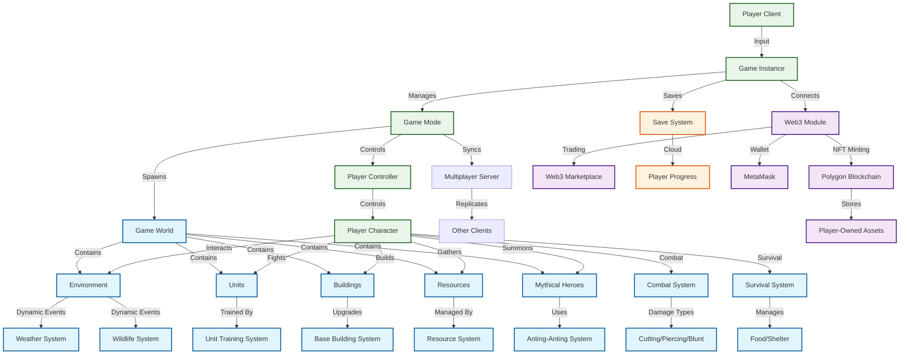
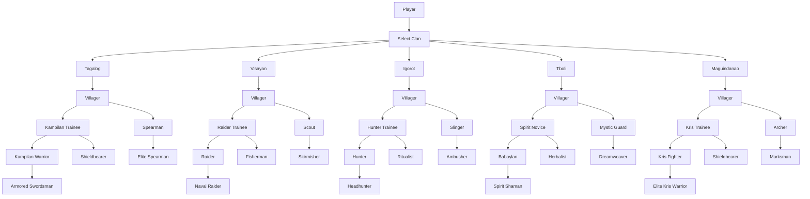
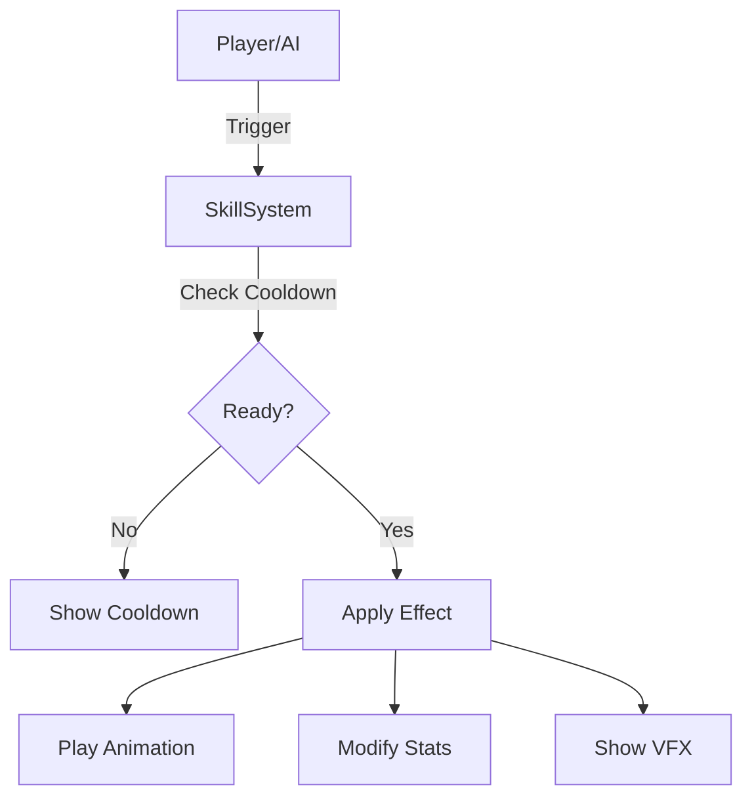
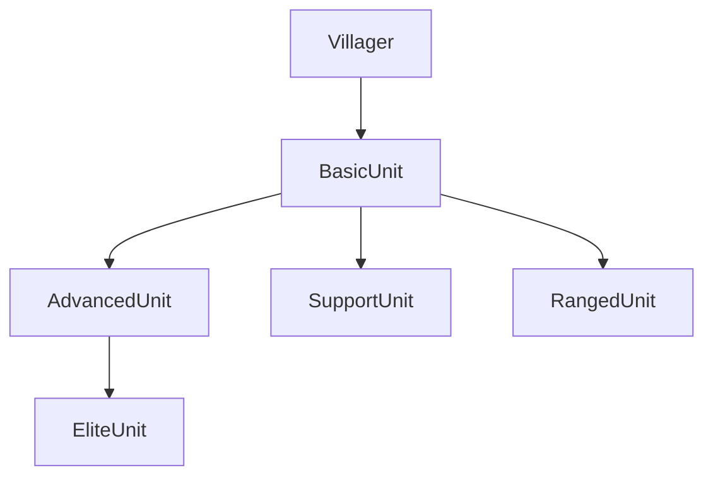

# System Architecture - Lakas ng Lahi

**Version**: 1.0  
**Last Updated**: December 2024  
**Document Owner**: Technical Architecture Team  
**Review Cycle**: Monthly  

## 📋 Table of Contents

- [Architecture Overview](#architecture-overview)
- [System Architecture Diagram](#system-architecture-diagram)
- [Component Details](#component-details)
- [Data Flow](#data-flow)
- [Integration Points](#integration-points)
- [Performance Considerations](#performance-considerations)
- [Security Architecture](#security-architecture)

## 🏗️ Architecture Overview

*Development Plan Update:*
- The first milestone for Lakas ng Lahi is a robust single player RTS experience. All core systems, UI, and gameplay will be designed for single player first. Multiplayer features (co-op, PvP, server sync) are planned for a future phase after the single player RTS is complete.

### High-Level Architecture
*Lakas ng Lahi* follows a hybrid client-server architecture with Web3 integration, designed for scalability, performance, and cultural authenticity. **The initial release will focus on single player RTS gameplay. Multiplayer and online features will be added in subsequent development phases.**

### Core Principles
- **Modularity**: Independent systems that can be developed and tested separately
- **Scalability**: Support for thousands of concurrent players
- **Cultural Sensitivity**: Architecture supports authentic cultural representation
- **Web3 Optional**: Blockchain features enhance but don't require Web3
- **Cross-Platform**: Unified codebase for PC and console platforms

## 📊 System Architecture Diagram



### Architecture Layers

#### 1. Player Layer
- **Player Client**: Handles user input and rendering
- **Game Instance**: Manages game state and session data
- **Player Controller**: Processes player actions and decisions

*Note: Multiplayer Server and Client Replication are planned for a future update. The initial version will be single player only.*

#### 2. Game Systems Layer
- **Game Mode**: Oversees game rules and multiplayer synchronization
- **Game World**: Contains all game entities and environments
- **Core Systems**: Combat, resources, training, building, survival

#### 3. Multiplayer Layer
- **Multiplayer Server**: Handles real-time synchronization
- **Client Replication**: Ensures consistent game state across players

#### 4. Web3 Layer
- **Web3 Module**: Manages blockchain interactions
- **Polygon Blockchain**: Stores NFT assets and player ownership
- **Marketplace**: Enables trading of digital assets

## 🏯 Clan System Architecture (Battle Realms Style)

The Clan System manages all unique units, skills, and upgrade paths for each tribe (clan). When a player selects a clan, the system enables only that clan’s units, buildings, and skills. Training and upgrades are handled through a branching structure, similar to Battle Realms, with each clan having its own unit tree and signature abilities.

### Clan System Flow (Mermaid Diagram)



- The Clan System is responsible for enabling/disabling units, skills, and buildings based on the player’s chosen clan. All upgrades and special abilities are managed within this system, ensuring each clan’s identity and gameplay style is preserved.

## 🗃️ Clan System Data Model

The Clan System manages all units, skills, and upgrades as structured data. Each clan has its own unit tree, skill set, and upgrade requirements. Example data model:

```json
{
  "clan": "Tagalog",
  "units": [
    {"name": "Kampilan Warrior", "type": "Advanced", "hp": 120, "atk": 30, "def": 10, "skills": ["Kampilan Charge"]},
    {"name": "Armored Swordsman", "type": "Elite", "hp": 160, "atk": 38, "def": 18, "skills": ["Shield Wall"]},
    ...
  ],
  "skills": [
    {"name": "Balangay Rally", "type": "Active", "effect": "+20% ATK/DEF", "cooldown": 30},
    ...
  ]
}
```

## ⚡ Skill System

- **Activation**: Skills are triggered by player or AI, checked for cooldown and resource cost.
- **Cooldowns**: Managed per unit/skill, with UI feedback.
- **Effects**: Applied to units, areas, or enemies (buff, debuff, damage, heal, etc.).
- **Lore/Flavor**: Each skill has a description and animation reference.

### Skill Activation Flow (Mermaid)


## 🔄 Upgrade Flow

- **Villager** trains at a clan-specific building to become a basic unit.
- Basic units can be upgraded at advanced buildings, unlocking new skills.
- Elite units require special resources/buildings.

### Upgrade Flow (Mermaid)


## 🛠️ Balance & Modding

- **Balance**: All unit stats and skills are stored in editable config files (JSON, CSV, or UE5 DataTables).
- **Modding**: Community can add/modify units, skills, or clans by editing data files and importing new assets.
- **Testing**: Built-in debug tools for stat/skill testing and balance iteration.

---

## 🔧 Component Details

### Player Client Architecture

#### Input Processing
```cpp
class PlayerInputManager {
    // Handles keyboard, mouse, and controller input
    void ProcessInput();
    void HandleCombatInput();
    void HandleBuildingInput();
    void HandleExplorationInput();
};
```

#### Rendering Pipeline
- **Unreal Engine 5**: Nanite for voxel assets, Lumen for lighting
- **Voxel Rendering**: Custom shaders for hand-painted aesthetic
- **Animation System**: Blend trees for smooth transitions
- **UI Rendering**: Custom HUD with cultural elements

### Game Systems

#### Unit Training System
```cpp
class UnitTrainingSystem {
    // Manages villager-to-warrior progression
    bool TrainUnit(UnitType type, Building* trainingFacility);
    void UpgradeUnit(Unit* unit, UpgradePath path);
    float GetTrainingTime(UnitType type);
};
```

#### Resource Management
```cpp
class ResourceSystem {
    // Handles dynamic resource generation and consumption
    void UpdateResources(float deltaTime);
    void ApplyWeatherEffects();
    void HandleWildlifeInteractions();
    bool ConsumeResource(ResourceType type, float amount);
};
```

#### Combat System
```cpp
class CombatSystem {
    // Manages both RTS and souls-like combat
    void ProcessRTSCombat();
    void ProcessPlayerCombat();
    float CalculateDamage(DamageType type, ArmorType armor);
    void ApplyStatusEffects(Unit* target, StatusEffect effect);
};
```

### Web3 Integration

#### Smart Contract Architecture
```solidity
// LakasNgLahi.sol
contract LakasNgLahi {
    struct AntingAnting {
        uint256 id;
        string name;
        string tribe;
        uint256 power;
        string metadata;
    }
    
    mapping(uint256 => AntingAnting) public antingAntings;
    mapping(address => uint256[]) public playerAntingAntings;
    
    function mintAntingAnting(string memory name, string memory tribe) external;
    function transferAntingAnting(uint256 id, address to) external;
}
```

#### Web3 Module
```cpp
class Web3Module {
    // Handles blockchain interactions
    bool ConnectWallet();
    bool MintNFT(NFTType type, string metadata);
    bool TransferAsset(uint256 assetId, address recipient);
    float GetGasEstimate();
};
```

## 🔄 Data Flow

### Game State Synchronization
1. **Player Input** → **Input Manager** → **Game Logic**
2. **Game Logic** → **State Update** → **Server Sync**
3. **Server Sync** → **Client Replication** → **Visual Update**

### Web3 Asset Flow
1. **Player Action** → **Web3 Module** → **Smart Contract**
2. **Smart Contract** → **Blockchain** → **Asset Storage**
3. **Asset Storage** → **Marketplace** → **Player Trading**

### Resource Flow
1. **Environment** → **Resource Generation** → **Player Collection**
2. **Player Collection** → **Resource System** → **Unit Training**
3. **Unit Training** → **Combat System** → **Anting-Anting Generation**

## 🔗 Integration Points

### External APIs
- **Steam API**: Achievements, friends, cloud saves
- **PlayStation Network**: Trophies, multiplayer
- **Xbox Live**: Achievements, multiplayer
- **Polygon RPC**: Blockchain transactions
- **IPFS**: NFT metadata storage

### Third-Party Services
- **AWS GameLift**: Multiplayer server hosting
- **Cloudflare**: CDN and DDoS protection
- **Moralis**: Web3 development platform
- **Discord**: Community integration

### Cultural Integration
- **NCIP Database**: Tribal information and cultural guidelines
- **Philippine Folklore Archive**: Mythological references
- **Historical Records**: Authentic historical data

## ⚡ Performance Considerations

### Optimization Strategies
- **LOD Systems**: Level of detail for distant objects
- **Occlusion Culling**: Hide objects not visible to player
- **Asset Streaming**: Load assets as needed
- **Memory Management**: Efficient resource allocation

### Scalability Targets
| Metric | Target | Current | Status |
|--------|--------|---------|--------|
| **Concurrent Players** | 10,000 | 0 | Planning |
| **Server Response Time** | <100ms | N/A | Design |
| **Client FPS** | 60+ | N/A | Design |
| **Web3 Transaction Time** | <5s | N/A | Design |

### Platform-Specific Optimizations
- **PC**: High-resolution textures, advanced lighting
- **PS5**: SSD optimization, DualSense integration
- **Xbox**: Quick Resume, Smart Delivery
- **Web3**: Gas optimization, batch transactions

## 🔒 Security Architecture

### Game Security
- **Anti-Cheat**: Server-side validation, client integrity checks
- **Data Protection**: Encrypted save files, secure communication
- **Access Control**: Role-based permissions, session management

### Web3 Security
- **Smart Contract Audits**: Third-party security reviews
- **Wallet Security**: MetaMask integration, transaction signing
- **Asset Protection**: NFT ownership verification, transfer validation

### Cultural Security
- **Content Moderation**: Cultural sensitivity filters
- **Community Guidelines**: Respectful representation policies
- **Expert Review**: Cultural consultant oversight

## 📈 Monitoring & Analytics

### Performance Monitoring
- **Server Metrics**: CPU, memory, network usage
- **Client Metrics**: FPS, loading times, crash rates
- **Web3 Metrics**: Transaction success rates, gas costs

### Player Analytics
- **Engagement**: Session length, feature usage
- **Retention**: Daily, weekly, monthly active users
- **Cultural Impact**: Educational content consumption

### Business Metrics
- **Revenue**: Sales, DLC purchases, NFT trading
- **Community**: Discord members, social media engagement
- **Cultural**: Educational partnerships, cultural recognition

---

**Document Status**: Draft  
**Next Review**: January 2025  
**Technical Review**: Lead Engineers  
**Last Modified**: [Date]