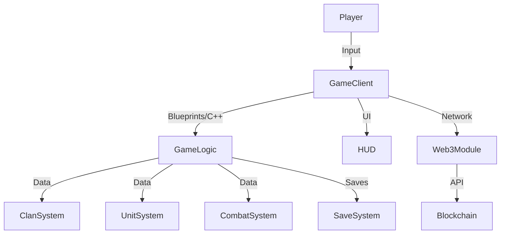
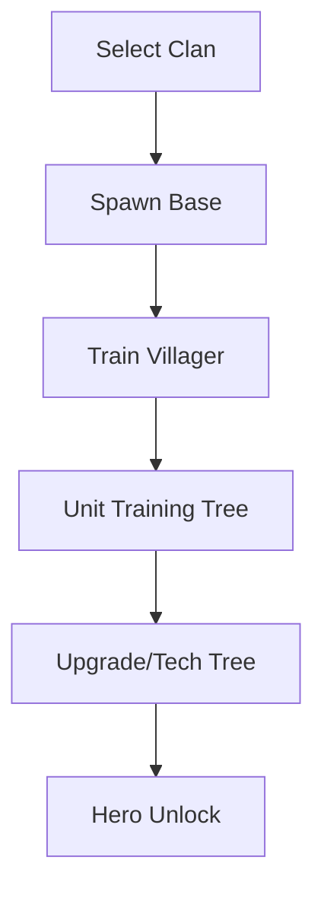
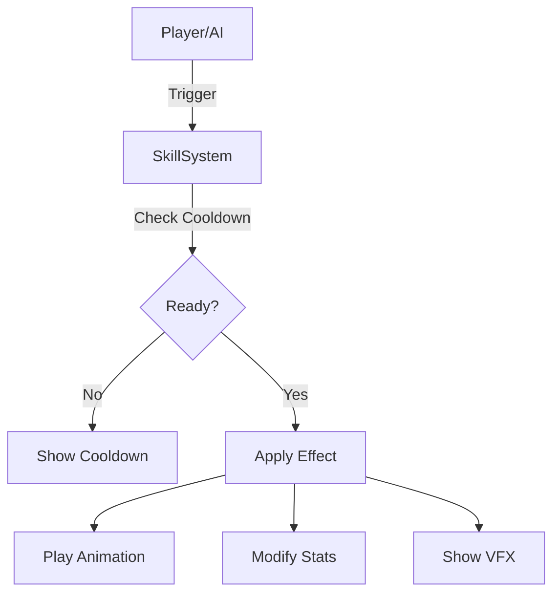
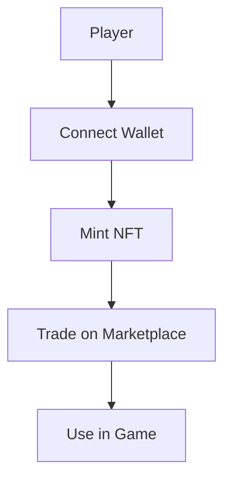

# Lakas ng Lahi - Architecture

---

## Overview
Lakas ng Lahi is built as a modular hybrid RTS/action-adventure game using Unreal Engine 5, with optional Web3 integration for NFTs and player-owned assets. The architecture is designed for scalability, maintainability, and cultural authenticity.

---

## System Architecture

- **GameClient:** Handles player input, UI, and rendering.
- **GameLogic:** Core gameplay logic (RTS, action, AI, etc.) in C++/Blueprints.
- **ClanSystem:** Manages clans, units, upgrades, and lore.
- **UnitSystem:** Handles unit stats, skills, and training trees.
- **CombatSystem:** Souls-like combat, skills, and effects.
- **SaveSystem:** Local and cloud saves.
- **Web3Module:** Optional; manages NFT, wallet, and blockchain interactions.
- **Blockchain:** Polygon smart contracts for NFTs, land, and marketplace.

---

## Clan & Unit System Flow

---

## Skill Activation Flow

---

## Web3 Integration
- **Chain:** Polygon (Matic)
- **NFTs:** ERC-721/1155 for cosmetics, land, and anting-anting
- **Wallets:** MetaMask, WalletConnect
- **Marketplace:** Decentralized, in-game UI

### Web3 User Flow

---

## Modular Design Principles
- **Blueprints & C++:** Core systems are modular and extensible.
- **Clan/Unit Data:** Easily add new clans, units, or skills via data tables.
- **Web3 Optional:** Game is fully playable without blockchain features.
- **Cultural Authenticity:** All content reviewed for accuracy and respect.

---

*For more details, see [game-design.md](./game-design.md), [web3-integration.md](./web3-integration.md), and [lore-bible.md](./lore-bible.md).* 