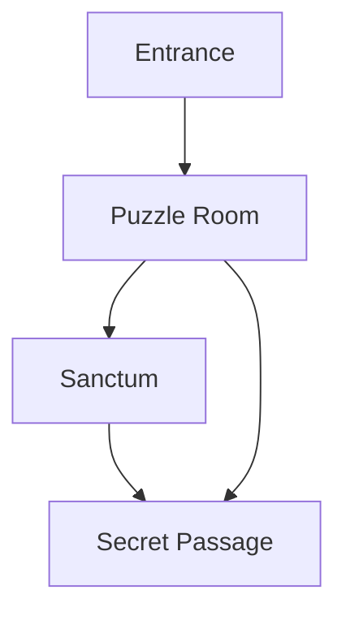

# Dungeon Map

---

## Sample Dungeon: The Sunken Shrine

### Key Locations
- **Entrance:** Flooded cave, guarded by sentries
- **Puzzle Room:** Rotating statues, water traps
- **Sanctum:** Boss fight, ancient relic
- **Secret Passage:** Hidden loot, shortcut

---

## Dungeon Layout (Mermaid)

---

*Add more dungeons and layouts as the game expands.* 