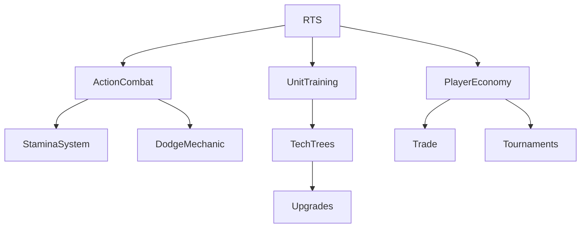

# Game Design Brainstorming

---

## Ideas
- Dynamic weather and day/night cycles
- Clan-specific ultimate abilities
- Player-driven economy and trade
- Procedural side quests
- Community events and tournaments

---

## Mechanics
- Hybrid RTS/action combat
- Unit training and tech trees
- Souls-like stamina and dodge system
- NFT cosmetics and land ownership (optional)
- Modular AI for enemy and ally units

---

## Open Questions
- How to balance RTS and action elements?
- What incentives for non-Web3 players?
- How to ensure cultural authenticity?
- What endgame content keeps players engaged?

---

## Feature Map (Mermaid)
