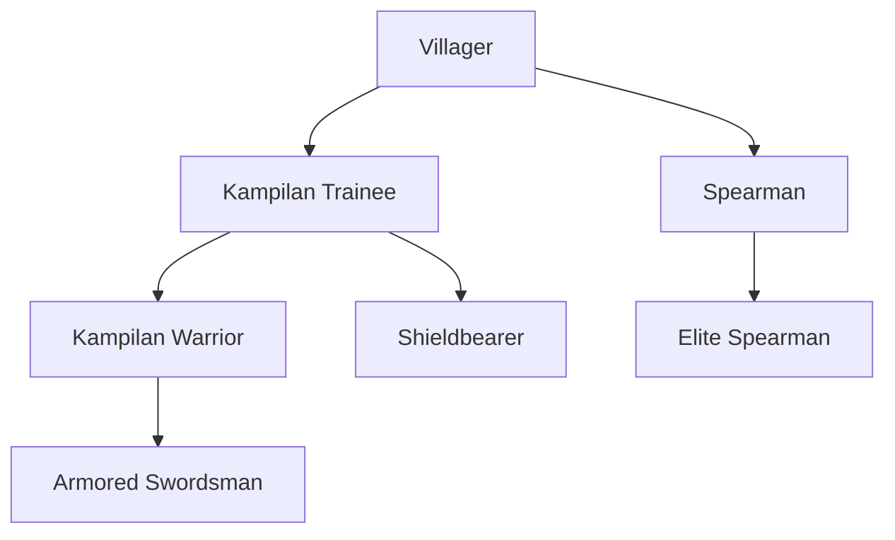
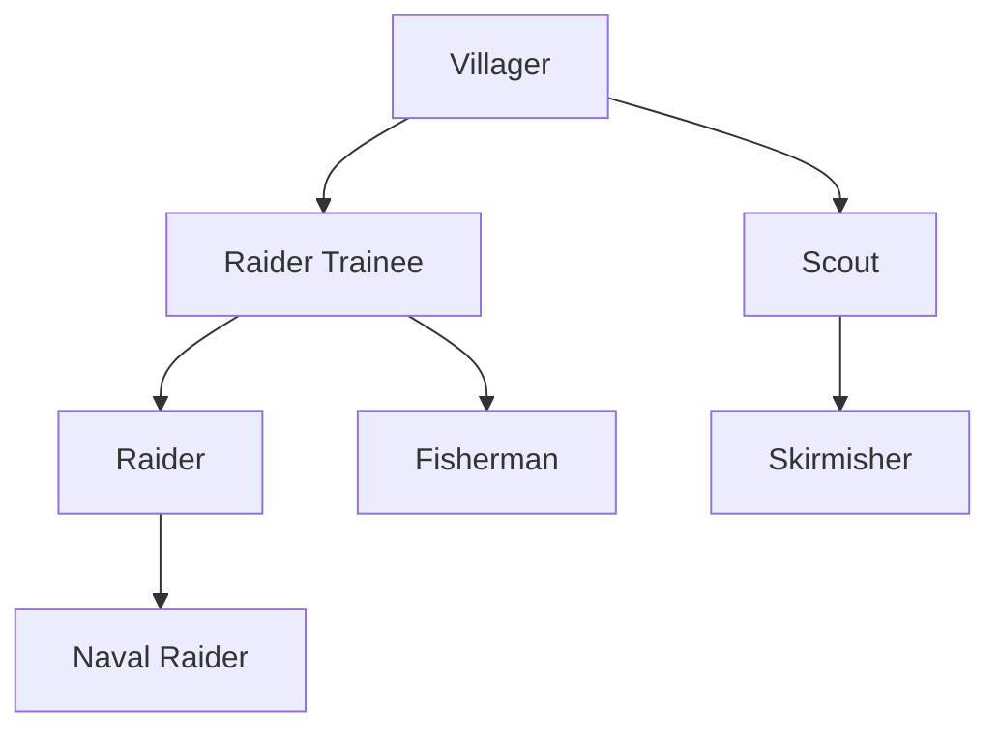
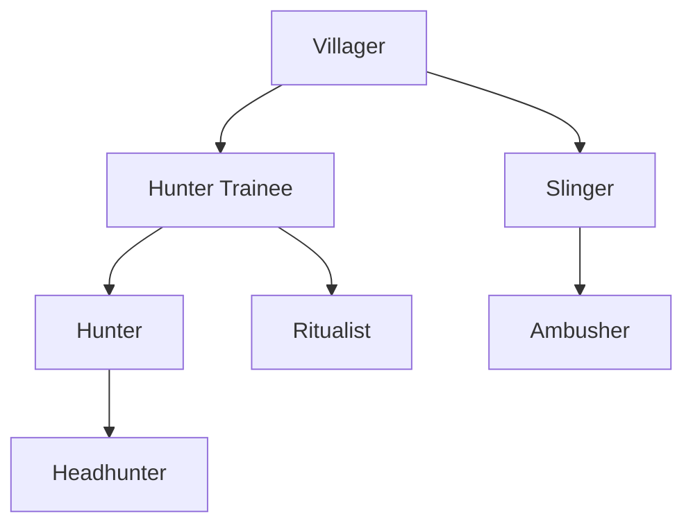
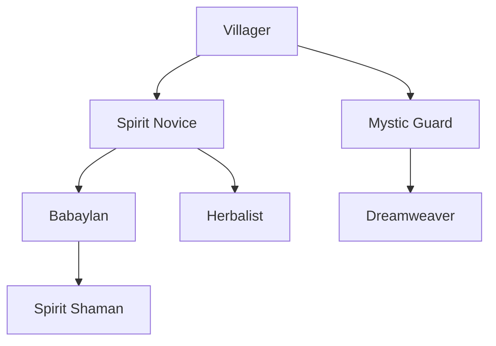
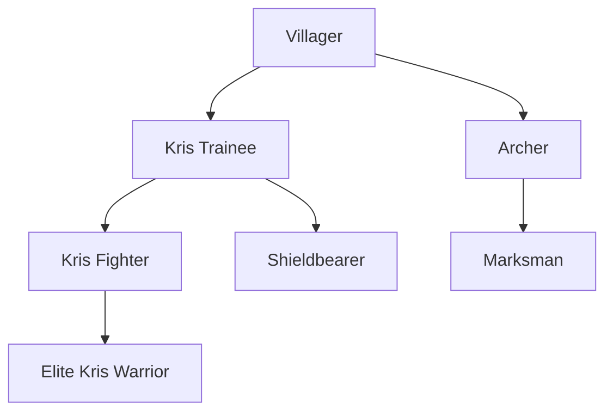
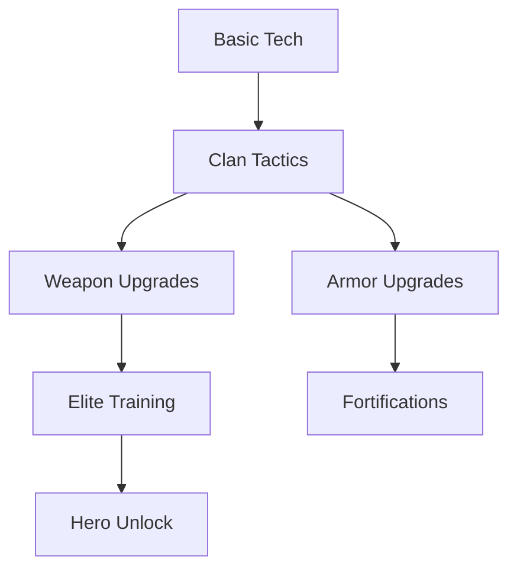
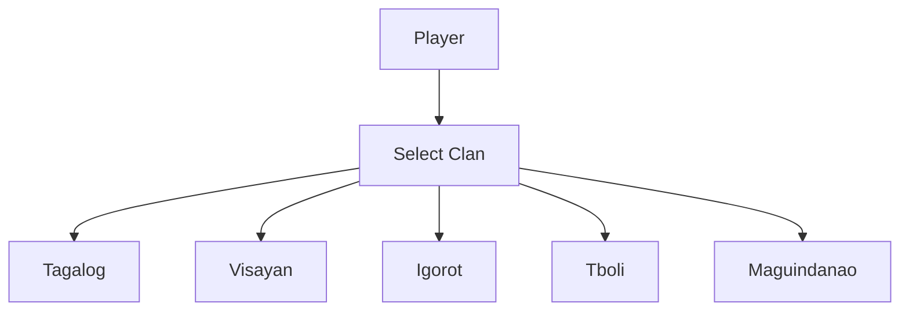
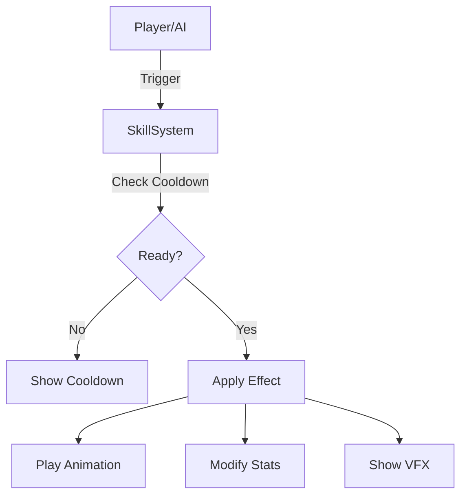
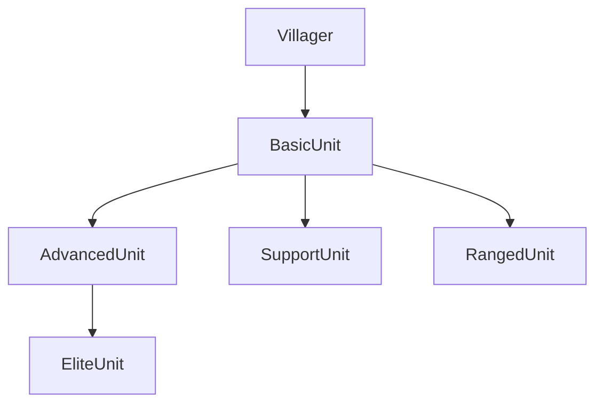

# Lakas ng Lahi - Game Design Document

---

## Overview
A hybrid RTS/action-adventure game inspired by Battle Realms and Ronin Trail, set in a semi-historical, semi-mythological Philippines. Players choose a clan, train unique units, and master both strategic and souls-like combat.

---

## Table of Contents
- [Clans & Philosophy](#clans--philosophy)
- [Unit Training Trees](#unit-training-trees)
- [Tech & Upgrade Trees](#tech--upgrade-trees)
- [Unit Stats & Skills](#unit-stats--skills)
- [Mermaid Diagrams](#mermaid-diagrams)
- [Lore Blurbs](#lore-blurbs)

---

## Clans & Philosophy

### Tagalog
- **Philosophy:** Honor, unity, and resilience. Masters of the kampilan and shield wall tactics.
- **Signature Hero:** Rajah Sulayman

### Visayan
- **Philosophy:** Seafaring, raiding, and adaptability. Naval prowess and swift skirmishers.
- **Signature Hero:** Datu Lapu-Lapu

### Igorot
- **Philosophy:** Guerrilla warfare, nature attunement, and spiritual rituals. Masters of ambush and terrain.
- **Signature Hero:** Apo Anno

### T'boli
- **Philosophy:** Mysticism, dreams, and spiritual guardianship. Unique support and shamanic units.
- **Signature Hero:** Lemlunay

### Maguindanao
- **Philosophy:** Martial discipline, archery, and kris mastery. Balanced offense and defense.
- **Signature Hero:** Sultan Kudarat

---

## Unit Training Trees

### Tagalog Clan

### Visayan Clan

### Igorot Clan

### T'boli Clan

### Maguindanao Clan

---

## Tech & Upgrade Trees

---

## Unit Stats & Skills

| Clan        | Unit                | HP  | ATK | DEF | Skills                |
|-------------|---------------------|-----|-----|-----|-----------------------|
| Tagalog     | Kampilan Warrior    | 120 | 30  | 10  | Kampilan Charge       |
| Tagalog     | Armored Swordsman   | 160 | 38  | 18  | Shield Wall           |
| Visayan     | Raider              | 110 | 28  | 8   | Sea Raid              |
| Visayan     | Naval Raider        | 130 | 32  | 12  | Boarding Party        |
| Igorot      | Hunter              | 100 | 26  | 8   | Forest Ambush         |
| Igorot      | Headhunter          | 140 | 36  | 14  | Trophy Hunt           |
| T'boli      | Babaylan            | 90  | 18  | 6   | Spirit Heal           |
| T'boli      | Spirit Shaman       | 110 | 22  | 10  | Dreamweave            |
| Maguindanao | Kris Fighter        | 115 | 29  | 9   | Kris Flurry           |
| Maguindanao | Marksman            | 105 | 34  | 7   | Eagle Eye             |

---

## Mermaid Diagrams

### Clan System Overview

### Skill Activation Flow

### Upgrade Flow

---

## Lore Blurbs

- **Tagalog:** The Tagalog warriors, led by Rajah Sulayman, are renowned for their discipline and shield tactics, defending their homeland with honor.
- **Visayan:** The Visayan raiders, under Datu Lapu-Lapu, rule the seas and strike swiftly, their courage legendary among the islands.
- **Igorot:** The Igorot clans, guided by Apo Anno, blend into the mountains, striking unseen and vanishing like spirits.
- **T'boli:** The T'boli, with Lemlunay as their spiritual guide, weave dreams and reality, healing and protecting their kin.
- **Maguindanao:** The Maguindanao, led by Sultan Kudarat, are masters of the kris and bow, balancing martial might with wisdom.

---

*For more details, see [lore-bible.md](./lore-bible.md), [moodboard.md](./moodboard.md), and [web3-integration.md](./web3-integration.md).* 