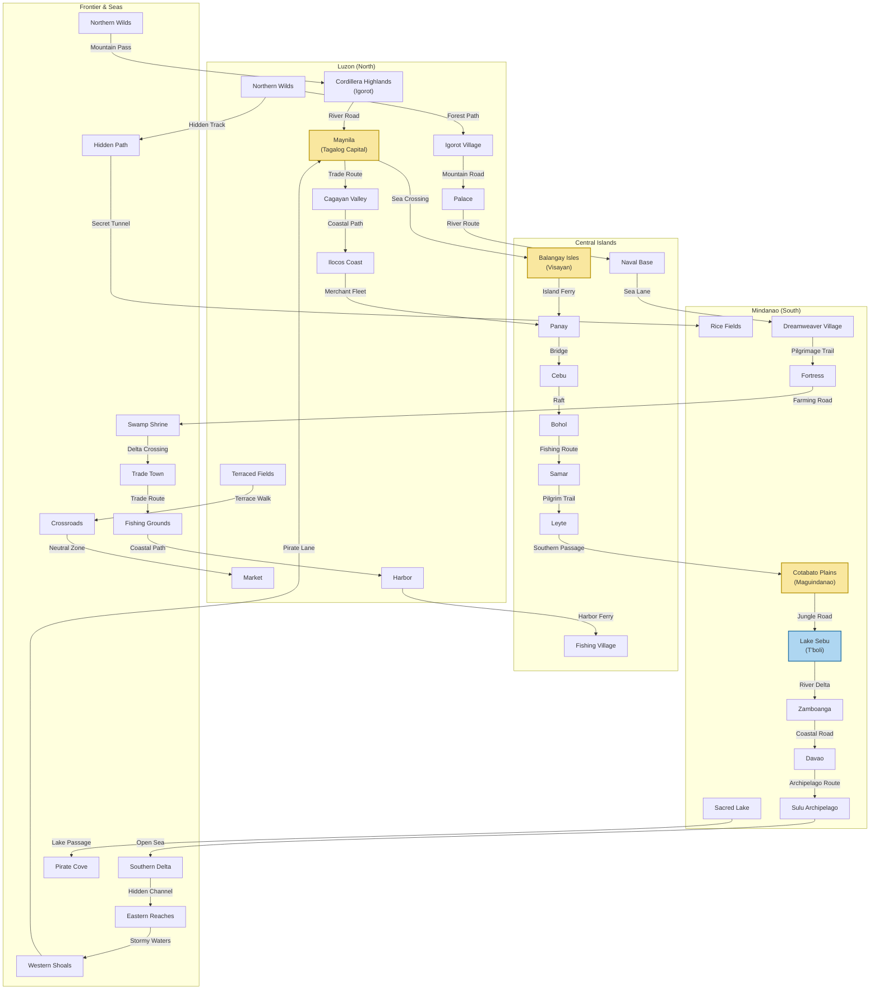

# Game Worldbuilding

---

## Major Places
- **Maynila:** Capital city, Tagalog stronghold, center of trade and politics.
- **Balangay Isles:** Visayan seafaring villages, naval bases.
- **Cordillera Highlands:** Igorot mountain settlements, terraced fields.
- **Lake Sebu:** T'boli spiritual center, dreamweaver villages.
- **Cotabato Plains:** Maguindanao fortresses, lush farmlands.
- **Northern Wilds:** Untamed forests, bandit camps, rare resources.
- **Southern Delta:** Swamps, hidden shrines, amphibious routes.
- **Central Plateau:** Trade crossroads, neutral towns, contested territory.
- **Eastern Reaches:** Coastal villages, fishing grounds, pirate coves.

---

## Inhabitants & Cultures
- **Tagalog:** Urban, disciplined, honor-bound.
- **Visayan:** Seafaring, adaptable, bold.
- **Igorot:** Nature-attuned, spiritual, guerrilla fighters.
- **T'boli:** Mystical, artistic, dreamweavers.
- **Maguindanao:** Martial, wise, balanced.

---

## Bug Report
| ID | Description | Location | Status |
|----|-------------|----------|--------|
| 1  | Example bug | Maynila   | Open   |

---

## Combined World Map (RTS + Velarde Style)
This map combines the detailed, game-like RTS layout with the historical, archipelagic flow inspired by the [Velarde Map of 1734](https://en.wikipedia.org/wiki/Velarde_map#/media/File:Carta_Hydrographica_y_Chorographica_de_las_Yslas_Filipinas_Dedicada_al_Rey_Nuestro_Se%C3%B1or_por_el_Mariscal_d._Campo_D._Fernando_Valdes_Tamon_Cavall%C2%BA_del_Orden_de_Santiago_de_Govor._Y_Capn.jpg). Regions are grouped by geography and culture, with strategic points and routes for gameplay, while also reflecting the north-to-south island chain of the Philippines.

---

*This combined map visually merges the strategic, game-like layout with the historical archipelagic structure, suitable for both gameplay and lore/worldbuilding.* 