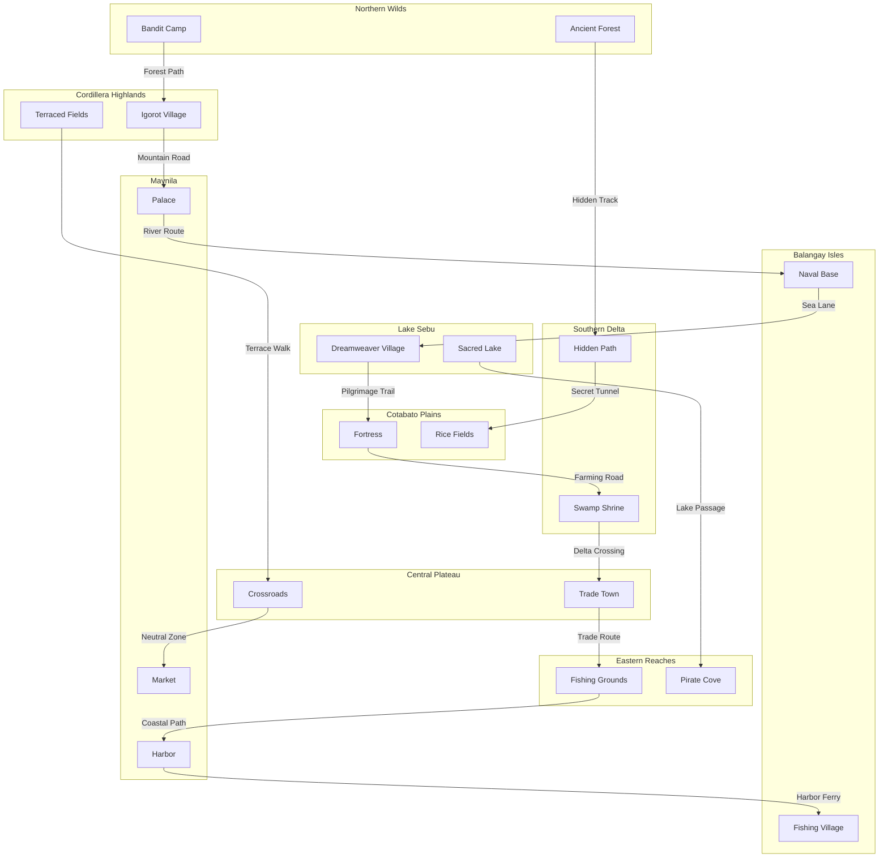

# Game Worldbuilding

---

## Major Places
- **Maynila:** Capital city, Tagalog stronghold, center of trade and politics.
- **Balangay Isles:** Visayan seafaring villages, naval bases.
- **Cordillera Highlands:** Igorot mountain settlements, terraced fields.
- **Lake Sebu:** T'boli spiritual center, dreamweaver villages.
- **Cotabato Plains:** Maguindanao fortresses, lush farmlands.
- **Northern Wilds:** Untamed forests, bandit camps, rare resources.
- **Southern Delta:** Swamps, hidden shrines, amphibious routes.
- **Central Plateau:** Trade crossroads, neutral towns, contested territory.
- **Eastern Reaches:** Coastal villages, fishing grounds, pirate coves.

---

## Inhabitants & Cultures
- **Tagalog:** Urban, disciplined, honor-bound.
- **Visayan:** Seafaring, adaptable, bold.
- **Igorot:** Nature-attuned, spiritual, guerrilla fighters.
- **T'boli:** Mystical, artistic, dreamweavers.
- **Maguindanao:** Martial, wise, balanced.

---

## Bug Report
| ID | Description | Location | Status |
|----|-------------|----------|--------|
| 1  | Example bug | Maynila   | Open   |

---

## World Map (Mermaid)

---

*Expand with new places, cultures, and bug reports as the world grows.* 