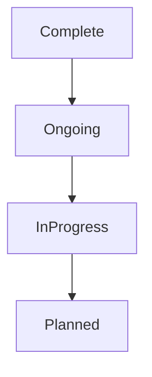

# Project Status & Progress

---

## 🚀 Implemented Features
| Feature | Status |
|---------|--------|
| Strategy Game Controller Pawn | Complete |
| Select and Move Characters | Complete |
| Edge Scrolling | Complete |
| Animated Cursors On Hover | Complete |
| Select and Command Multiple Characters | Ongoing |
| Character Switching | Ongoing |

---

## 🔄 In Progress
| Feature | Status |
|---------|--------|
| Box Select / Drag Select | In Progress |
| Water Foams and Waves | In Progress |
| Focus and Cycle through Characters | In Progress |
| Follow Mode / Unit Tracking | In Progress |
| Accelerated Edge Scrolling | In Progress |
| Minimap | In Progress |
| Minimap Navigation | In Progress |
| Minimap Rotation | In Progress |
| Multiplayer Replication | In Progress |
| Multiplayer Set Starting Positions | In Progress |
| Unit Ownership | In Progress |
| Unit Outlines | In Progress |
| Fight Animations | In Progress |
| Attack Enemies | In Progress |
| Attack Replication | In Progress |
| Damage Replication | In Progress |
| Enemy Units Fight Back | In Progress |
| Defense Towers | In Progress |
| WASD Camera Movement | In Progress |
| Strategy Game Template | In Progress |
| Selected Characters Move Into Formation | In Progress |
| Breaking Formation in Limited Spaces | In Progress |
| Coordinated Unit Movement | In Progress |

---

## 📝 Planned / Upcoming
| Feature | Status |
|---------|--------|
| (Add your next planned features here) | Planned |

---

## Workflow (Mermaid)

---

*Update this file regularly to track your progress!*