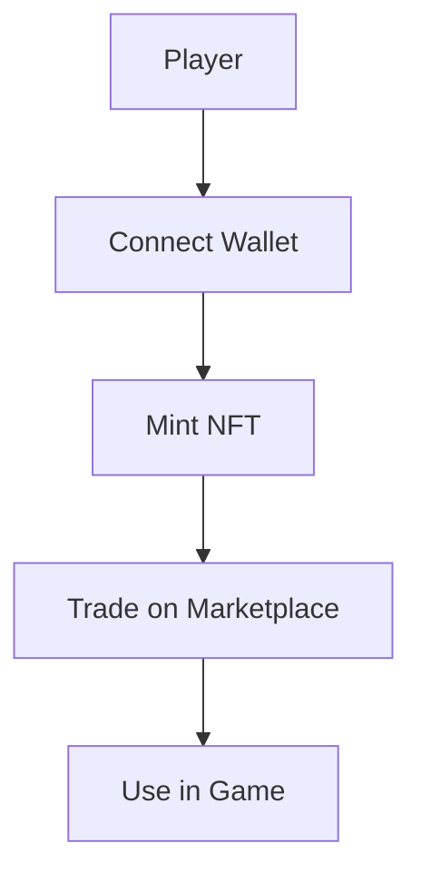

# Lakas ng Lahi - Web3 Integration

---

## Overview
Lakas ng Lahi integrates Web2 and Web3 features, allowing players to own NFT cosmetics, land parcels, and trade assets on a decentralized marketplace. Blockchain is optional and enhances, not replaces, core gameplay.

---

## Blockchain Platform
- **Chain:** Polygon (Matic)
- **Smart Contracts:** Solidity, ERC-721 for NFTs, ERC-1155 for multi-assets
- **Wallets:** MetaMask, WalletConnect

---

## NFT Types
- **Cosmetics:** Clan banners, hero skins, weapon skins
- **Land Parcels:** Player-owned, tradable, with on-chain stats
- **Anting-Anting:** Unique power-ups, tradable, with lore

---

## Marketplace Design
- **Decentralized:** Peer-to-peer trading, no central authority
- **In-Game Integration:** Buy/sell NFTs directly from the game UI
- **Clan-Specific NFTs:**
    - Tagalog: Sun Banner, Kampilan Skin
    - Visayan: Balangay Boat, Hawk Tattoo
    - Igorot: Eagle Headdress, Ritual Drum
    - T'boli: Dreamcatcher, T'nalak Pattern
    - Maguindanao: Crescent Shield, Kris Blade

---

## Example NFT Metadata
```json
{
  "name": "Kampilan of Sulayman",
  "description": "A legendary kampilan sword wielded by Rajah Sulayman.",
  "clan": "Tagalog",
  "type": "Weapon Skin",
  "attributes": [
    {"trait_type": "Attack Bonus", "value": 10},
    {"trait_type": "Lore", "value": "Forged in the fires of Maynila."}
  ]
}
```

---

## Web3 User Flow (Mermaid)


---

*For smart contract details, see [architecture.md](./architecture.md).* 