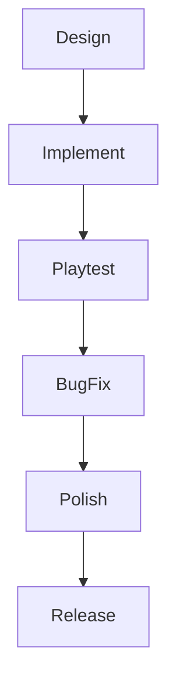

# Weekly Plan & Feature Schedule

---

## This Week's Goals
| Day       | Task                        | Status  |
|-----------|-----------------------------|---------|
| Monday    | Design new clan units       | In Progress |
| Tuesday   | Implement unit training UI  | Pending |
| Wednesday | Add lore to lore-bible.md   | Pending |
| Thursday  | Playtest combat mechanics   | Pending |
| Friday    | Bug fixing & polish         | Pending |

---

## Workflow (Mermaid)

---

*Update this plan weekly to track progress and stay on schedule.* 